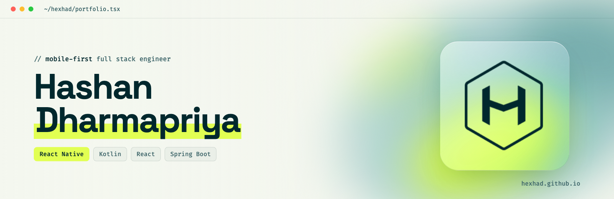

<a href="https://hexhad.github.io">
  <picture>
    <source media="(prefers-color-scheme: dark)" srcset="./docs/img/dark-banner.png" />
    <source media="(prefers-color-scheme: light)" srcset="./docs/img/light-banner.png" />
    
  </picture>
</a>

<p align="center">
  <a href="https://hexhad.github.io"><b>hexhad.github.io</b></a> ·
  <a href="https://linkedin.com/in/hashandharmapriya">LinkedIn</a> ·
  <a href="https://github.com/hexhad">GitHub</a> ·
  <a href="mailto:hashandharmapriya@gmail.com">Email</a>
</p>

# hexhad.github.io

Personal portfolio of **Hashan Dharmapriya**, a senior software engineer who builds mobile apps first
(React Native and Kotlin) and the React and Spring Boot pieces around them.

The site is a single static page with no build step, so GitHub Pages serves it straight from `master`.

## What's inside

| Area | Details |
| --- | --- |
| **Desktop** | A macOS-style window with IDE tabs that track the section you're reading. Menubar and titlebar use liquid glass. |
| **Hero** | A Three.js shader gradient (noise-displaced plane, after [shadergradient](https://github.com/ruucm/shadergradient)) with the hexhad logo in liquid chrome (inspired by [liquid-logo](https://github.com/paper-design/liquid-logo)). |
| **Tablet** | The same content runs inside an iPhone frame that scales to fit the viewport. |
| **Phone** | The frame goes away and the page becomes a native-feeling app with a floating liquid glass tab bar. |
| **Glass** | `backdrop-filter` plus an SVG displacement map for refraction in Chromium, with a frosted fallback elsewhere. This approximates Apple's Liquid Glass on the web and is not Apple's material. |
| **Motion** | Custom ease-out curves, springs for decorative motion, and `prefers-reduced-motion` support throughout. |

## Project layout

```
index.html            page markup and styles
js/main.js            UI behaviour (tabs, reveals, tab bar, toast, lazy scene boot)
js/liquid-scene.js    Three.js hero scene (loaded on idle from jsDelivr)
src/                  logo, favicon, touch icon
docs/banner.html      source for the README banners
docs/render-banners.sh  renders docs/img/{dark,light}-banner.png via headless Chrome
```

## Run locally

```bash
python3 -m http.server 8765
# open http://localhost:8765
```

To regenerate the README banners after editing `docs/banner.html`:

```bash
./docs/render-banners.sh
```

## Open source

- [`@hexhad/react-native-global-modal`](https://www.npmjs.com/package/@hexhad/react-native-global-modal): global alert queue for React Native
- [`@hexhad/react-utils`](https://www.npmjs.com/package/@hexhad/react-utils): performance-focused React / RN utilities
- `react-native-nitro-otp-verify`: SMS Retriever OTP on Nitro Modules

---

<p align="center"><sub>© Hashan Dharmapriya · Built with ♥</sub></p>
